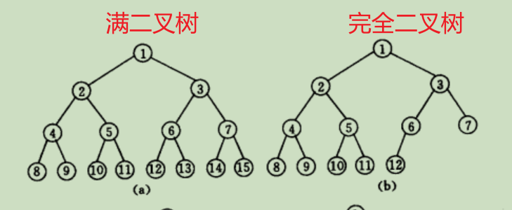

# dataSA
## 一、介绍
一个用作学习记录的仓库

## 二、编译命令
```sh
1. mkdir /build
2. cd /build
3. cmake .. -G "MinGW Makefiles"    # 一般没有 -G "MinGW Makefiles"
4. make
```

---
## 三、学习笔记
### 1.线性表


### 6. 树
节点拥有的子树个数称为**节点的度**，度为0的结点称为**叶子结点**，**树的度**是树内各结点的度的最大值。
树中结点的最大层次称为**树的深度**(Depth) 或高度

**二叉树**：二叉树中不存在度大于2的结点，并且二叉树的子树有左右之分。

**满二叉树**：一棵深度为 K 且有 2^k^ - 1 个结点的二叉树称为满二叉树。

**完全二叉树**：
1. 叶子结点只可能在层次最大的两层上出现； 
2. 对任一结点．若其右分支下的子孙的最大层次为L,则其左分支下的子孙的最大层次必为L或L+l。


---
### 9. 查找
**静态查找表**：仅对表进行“元素”、“属性”查找操作。
**动态查找表**：不仅对表内容进行查找，还会在表中进行“插入”、“删除”操作。

---

> 提高查找机率的方法：
> 1. 使表中记录按查找概率由小至大重新排列，以便提高查找效率；
> 
> 2. 在每个记录中附设一个访问频度域，并使表中的记录保持按访问频度非递减有序的次序排列；
>
> 3. 对于有序表可以采用折半查找；
