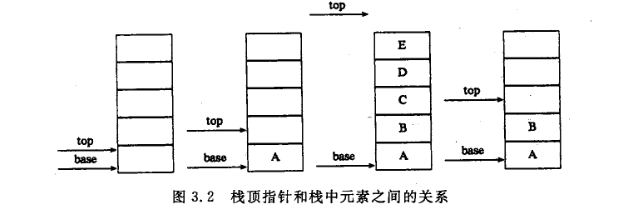

# 栈
## 一、定义
**栈**是限定仅在表尾进行插入或删除操作的线性表，表尾端称为**栈顶(top)**，表头端称为**栈底(bottom)**。不含元素的空表称为**空栈**。

栈是典型的**后进先出(LIFO)**(last in first out)结构。

---

## 二、实现
数据结构：
```c
typedef struct SqStack {
    SElemType* base;  /* 栈底 */
    SElemType* top;   /* 栈顶 */ 
    int  stacksize;   /* 最大容量 */
}
```


## 三、应用
1. 数制转换
2. 括号匹配的校验
3. 行编辑程序
4. 迷宫求解
5. 表达式求值
6. 实现递归
   1. Hanoi塔
   2. 斐波那契数列
   3. 阶乘函数
   4. Ackerman函数

---

# 队列
## 一、定义
队列是一种**先进先出**(first in first out,缩写为**FIFO**)的线性表。在队列中，允许插入的一端叫做**队尾(rear)**，允许删除的一端为**队头(front)**。

## 双端队列
限定插入和删除操作在表的两端进行的线性表。

## 循环队列
顺序表实现
判断循环队列满的方法：
1. 设一个标志位
2. 少用一个元素空间